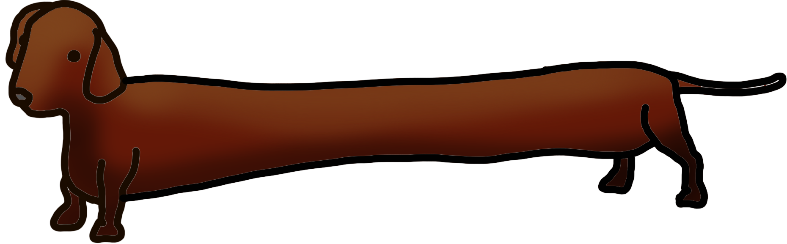

<p align=center></p>
<h3 align=center>d o c s h u n d</h3>
<h6 align=center>simple code documentation generation</h6>

> NOTE: Docshund is in alpha and is not yet suitable for production workloads. Please exercise caution when using.

# Installation

```python
git clone https://github.com/FitMango/docshund
cd docshund
pip3 install -U .
```

# Usage

```shell
docshund code.py > documentation.md
```

## What she do:

Go from this:

```python
class Foo:
    """
    This is a foo.

    Do not cross the foo streams!
    """

    def __init__(self):
        """
        Create a new foo.
        """

    def cross_streams(self, other_foo: Foo = None):
        """
        Cross the streams of this foo with another foo.

        If you do this, it will throw an error.

        Arguments:
            other_foo (Foo: None): The foo with which you'd like to cross streams

        Returns:
            None

        Raises:
            FooError: Raised if you cross the streams.

        """
        if other_foo:
            raise FooError("What did we JUST tell you?!")
```

To this markdown:


